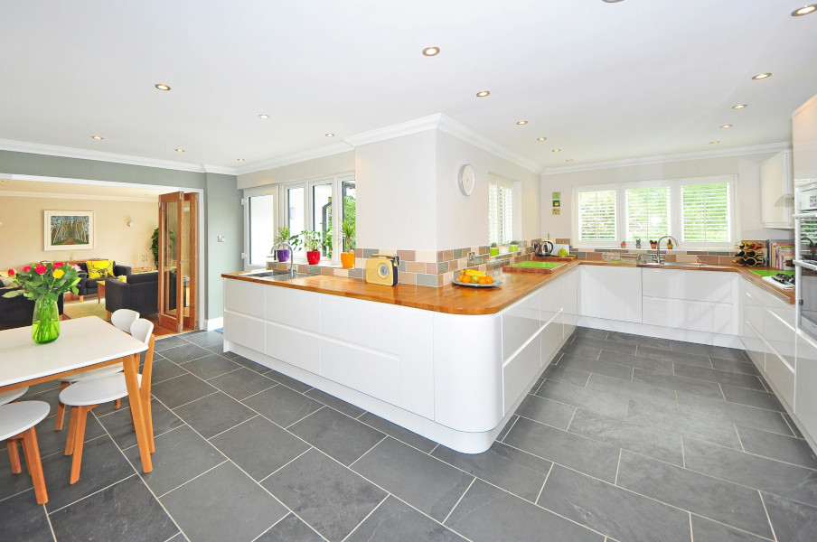

# V.K-Tile - Professional Tile Installation Services

A modern and responsive website for V.K-Tile, a professional tile installation service based in Seattle, built with Next.js and Tailwind CSS.



## Features

- 📱 Fully responsive design for all device sizes
- 🎨 Beautiful UI with custom animations using Framer Motion
- 🧩 Component-based architecture for maintainability
- 🔍 SEO-friendly setup with Next.js
- 🚀 Optimized for performance with static site generation
- 💅 Custom styling with Tailwind CSS

## Tech Stack

- **Framework**: [Next.js 15](https://nextjs.org/)
- **Language**: [TypeScript](https://www.typescriptlang.org/)
- **Styling**: [Tailwind CSS](https://tailwindcss.com/)
- **UI Components**: [Radix UI](https://www.radix-ui.com/) with custom design system
- **Animation**: [Framer Motion](https://www.framer.com/motion/)
- **Icons**: [Lucide React](https://lucide.dev/)
- **Package Manager**: [pnpm](https://pnpm.io/)

## Prerequisites

- [Node.js](https://nodejs.org/) (>=20.11.0)
- [pnpm](https://pnpm.io/) (recommended) or npm/yarn

## Installation

1. Clone the repository:

```bash
git clone https://github.com/yourusername/VkTile-web.git
cd VkTile-web
```

2. Install dependencies:

```bash
pnpm install
# or
npm install
```

## Development

Run the development server:

```bash
pnpm dev
# or
npm run dev
```

Open [http://localhost:3000](http://localhost:3000) in your browser to view the website.

## Building for Production

To build the website for production:

```bash
pnpm build
# or
npm run build
```

The static site will be generated in the `out` directory (due to the `output: 'export'` setting in next.config.mjs).

## Deployment

The website is configured for static site generation, which means it can be deployed to various hosting services like Vercel, Netlify, GitHub Pages, or any static hosting provider.

### Deploying to Vercel (Recommended)

The easiest way to deploy the website is through [Vercel](https://vercel.com/), the platform created by the makers of Next.js.

1. Push your code to a GitHub repository
2. Import the project into Vercel
3. Vercel will automatically detect the Next.js configuration and deploy your site

### Manual Deployment

After building the project:

1. Take the contents of the `out` directory
2. Upload them to your web hosting service

## Project Structure

```
VkTile-web/
├── app/                  # Next.js app directory
│   ├── globals.css       # Global CSS
│   ├── layout.tsx        # Root layout
│   └── page.tsx          # Home page
├── components/           # React components
│   ├── layout/           # Layout components (Header, Footer)
│   ├── sections/         # Page sections (Hero, Features, etc.)
│   └── ui/               # UI components (buttons, forms, etc.)
├── hooks/                # Custom React hooks
├── lib/                  # Utility functions
├── public/               # Static assets
└── styles/               # Additional styles
```

## Customization

### Changing Content

Most of the website content can be modified by editing the components in the `components/sections/` directory.

### Styling

The website uses Tailwind CSS for styling. You can customize the theme in `tailwind.config.js`.

## License

This project is licensed under the terms found in the [LICENSE](LICENSE) file.

## Contact

For inquiries about the website or tile installation services, please contact hi@ron.wang.

---

Built with ❤️ using Next.js and Tailwind CSS
